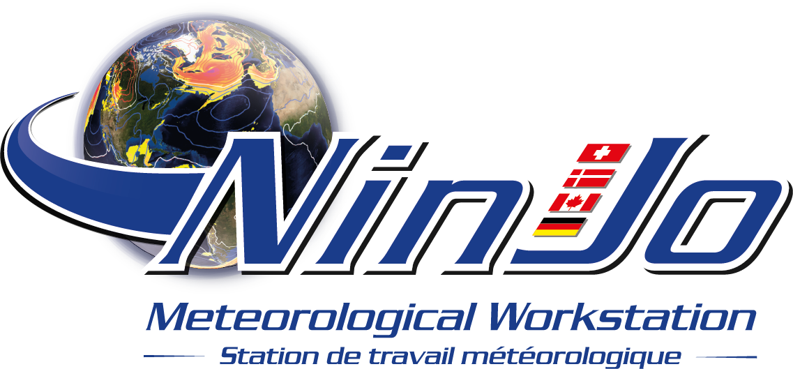



# NinJo Workstation Software Highlights 

The NinJo Workstation System showing different types of meteorological data

The NinJo Workstation Software is an ultramodern meteorological workstation system with

- multi-window technology,
- layer-based visualisation of different data types,
- easily integrated geographic map displays,
- diagrams, such as meteograms, cross-sections and tephigrams,
- monitoring of incoming data,
- animation and graphical export capabilities,
- interactive and automatic product generation,
- a graphical editor to produce your own synoptic charts,
- NƒL,  the NinJo Formula Language,
- a flexible client/server architecture as well as
- a high degree of configurability.

NinJo is immediately usable without altering code. 

Are you interested in more? Please read the [Overview](overview.html) for a brief introduction.

NinJo is the outcome of a successful [international collaboration](members.html) by various meteorological services with support from experienced IT companies.
